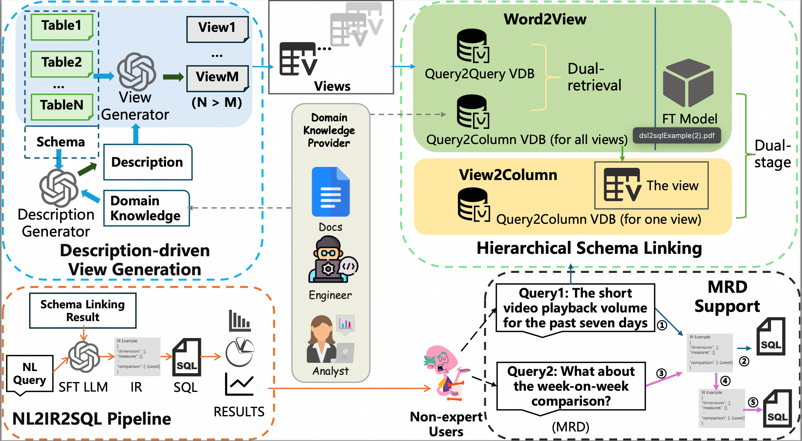

# CoeusBI - A Comprehensive LLM-Powered Interactive Business Intelligence Systems in Baidu

## 🚀 Key Innovations
- ​**Description-driven View Generation Module Deployed at the Data Modeling Layer**  
  converts complex JOIN queries into simple single-view queries by using generated descriptions to generate views. 
- ​**Hierarchical Schema Linking Module**  
  leverages vector retrieval over views to support schema linking under wide schemas. 
- ​**NL2IR2SQL Pipeline**  
  employs an Intermediate Representation (IR) to provide low-cost, multi-dialect support while improving SQL-generation accuracy.
- ​**IR-based MRD Support Module**  
  delivers accurate MRD handling

## 📊 NL2SQL Performance
### On Public Benchmarks
| Dataset                 | EX          |   
|-------------------------|-------------|
| BIRD                    | 71.41%      | 
### On Production Datasets
| Dataset                 | UEX         |   
|-------------------------|-------------|
| SRD production dataset  | 86.5%      | 
| MRD production dataset  | 83.3%      | 

## 📂 Dataset Access
We release our dataset using the same open‑sourcing way as SiriusBI. 
1. ​**SRD production dataset**  
   It is available under the directory `SRD-production-dataset`.
2. ​**MRD production dataset**  
   It is available under the directory `MRD-production-dataset`.

## 📂 Prompt Files
1. ​**NL2IR SFT prompt**  
   It is available under the directory `NL2IR-SFT-prompt`.
2. ​**MRD support prompt**  
   It is available under the directory `MRD-support-prompt`.

## 📂 Views File
1. ​**BIRD-dev with Views**  
   It is available under the directory `BIRD-dev-with-views`.  
   All views are generated by the model gpt-5-0807-global.  

## 🔧 System Architecture  

